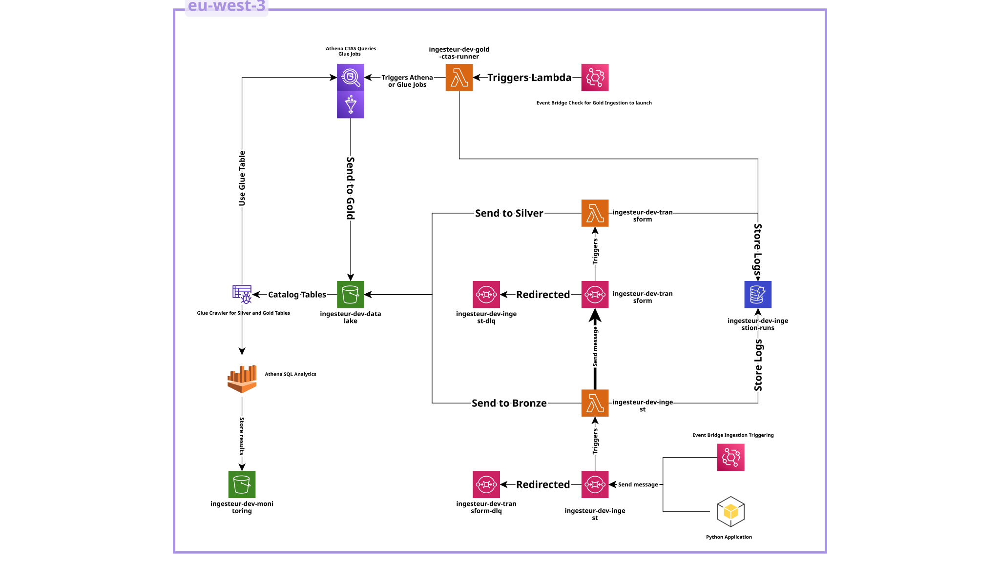

# AWS Ingestion Pipeline

This project implements a generic and scalable ingestion pipeline on AWS. It is designed to fetch data from various sources through API calls, store it in a data lake on S3, and transform it into a queryable format.

## Objective

The main objective of this project is to provide a ready-to-use, infrastructure-as-code solution for building data ingestion pipelines. It aims to be configuration-driven, allowing users to easily add new data sources by simply adding configuration files, without modifying the core logic of the pipeline.

## Architecture

The pipeline is composed of several AWS services, orchestrated by Terraform. The following diagram illustrates the architecture of the project:



### Data Flow

1.  **Trigger**: An Amazon EventBridge rule is configured to periodically send a message to an SQS queue. This message contains the necessary information to start the ingestion process, such as the data source and entity to be ingested.
2.  **Ingestion Queue**: The Amazon SQS `ingest` queue receives the message from EventBridge.
3.  **Ingest Lambda**: An AWS Lambda function, triggered by the `ingest` queue, is responsible for fetching the data from the source API. The details of the API call (endpoint, parameters, etc.) are defined in a "contract" file stored on S3.
4.  **Bronze Layer**: The raw data fetched from the API is stored in the "bronze" layer of the S3 data lake in JSONL format. A manifest file containing metadata about the ingestion is also created.
5.  **Transform Queue**: After successfully storing the data in the bronze layer, the `ingest` Lambda sends a message to the `transform` SQS queue.
6.  **Transform Lambda**: Another Lambda function, triggered by the `transform` queue, is responsible for processing the raw data.
7.  **Silver Layer**: The `transform` Lambda reads the data from the bronze layer, applies transformations based on a "schema" file (also stored on S3), and stores the result in the "silver" layer of the data lake in Parquet format. The silver layer is partitioned for efficient querying.
8.  **Gold Layer**: The final "gold" layer is created from the silver layer using Amazon Athena CTAS (Create Table As Select) queries. This layer represents the data in a denormalized and aggregated form, ready for consumption by business intelligence tools and data analysis applications.
9.  **Tracking**: An Amazon DynamoDB table is used to track the status of each ingestion run, providing idempotency and a detailed history of the pipeline's executions.

## Repository Structure

The repository is organized into the following directories:

*   `configs_local`: Contains local copies of the contract and schema configuration files. These files are meant to be uploaded to S3 by the `config_publisher` tool.
    *   `contracts`: Contains the contract files, which define how to fetch data from the source APIs. Each data source has its own subdirectory.
    *   `schema`: Contains the schema files, which define how to transform and store the data in the data lake.

*   `infra`: Contains all the Terraform code for deploying the infrastructure.
    *   `modules`: Contains the reusable Terraform modules.
        *   `lambda`: Manages the Lambda functions.
            *   `functions`: Contains the source code for the Lambda functions.
                *   `ingest`: The Lambda function for ingesting data from the source APIs.
                *   `transform`: The Lambda function for transforming the raw data.
                *   `gold_ctas_runner`: The Lambda function for running the Athena CTAS queries.
        *   `lambda_layer`: Manages the Lambda layers.
            *   `layers`: Contains the requirements files for the Lambda layers. Each layer has its own subdirectory with a `requirements.txt` file.

*   `tools`: Contains a set of Python scripts for interacting with the pipeline.
    *   `config_publisher`: This tool validates the local contract and schema files and uploads them to the S3 bucket.
    *   `ingestion_requester`: This tool sends a message to the SQS `ingest` queue to manually trigger an ingestion run.
    *   `smoke_tests`: This tool runs a series of end-to-end tests to verify that the pipeline is working correctly. It includes a `ddb_tracker` to check the DynamoDB tracking table, an `s3_finder` to check for files in the data lake, and an `sqs_probe` to check the SQS queues.

*   `test`: Contains the unit and integration tests for the local tools.

## Features

*   **Infrastructure as Code**: The entire infrastructure is managed by Terraform, ensuring reproducibility and easy customization.
*   **Configuration-Driven**: New data sources can be added by simply creating YAML configuration files (contracts and schemas).
*   **Scalable and Serverless**: The pipeline is built on serverless components (Lambda, SQS, S3), which allows it to scale automatically based on the workload.
*   **Data Lake Architecture**: The data is organized into three layers (bronze, silver, and gold), following the best practices for data lake design.
*   **Idempotency**: The pipeline is designed to be idempotent, meaning that re-running it for the same period will not produce duplicate data.
*   **Monitoring and Logging**: The pipeline is configured to send logs to Amazon CloudWatch.
*   **Local Tooling**: The project includes a set of local tools for managing configurations and running tests.

## Requirements

*   [Terraform](https://www.terraform.io/downloads.html)
*   [Python 3.9+](https://www.python.org/downloads/)
*   An AWS account with the necessary permissions.

The Python dependencies are listed in the `requirements.txt` file:

*   `boto3`: The AWS SDK for Python.
*   `requests`: For making HTTP requests to the APIs.
*   `pydantic`: For data validation and settings management.

## How to use it

### AWS Configuration

Before you begin, make sure you have configured your AWS credentials.

### Deployment

1.  **Initialize Terraform**:
    ```bash
    cd infra
    terraform init
    ```
2.  **Review the plan**:
    ```bash
    terraform plan
    ```
3.  **Apply the changes**:
    ```bash
    terraform apply
    ```

### Local Tools

The `tools` directory contains a set of Python scripts for interacting with the pipeline.

*   `config_publisher`: For validating and uploading the contract and schema configuration files to S3.
*   `ingestion_requester`: For manually triggering an ingestion run by sending a message to the SQS `ingest` queue.
*   `smoke_tests`: For running end-to-end tests to ensure the pipeline is working correctly.

To use the tools, you first need to install the dependencies:

```bash
pip install -r requirements.txt
```

Then, you can run each tool using `python -m tools.<tool_name>.main`.

## Terraform Modules

The Terraform code is organized into several modules, located in the `infra/modules` directory.

*   `athena`: Creates the Athena database and workgroup.
*   `dynamodb`: Creates the DynamoDB table for tracking ingestion runs.
*   `eventbridge_ingest_schedule`: Creates the EventBridge rule for scheduling ingestions.
*   `glue_catalog`: Creates the Glue Data Catalog.
*   `gold_ctas`: Manages the Gold layer creation using Athena CTAS.
*   `iam`: Defines the IAM roles and policies.
*   `ingesteur`: The main module that orchestrates all the other modules.
*   `lambda`: Manages the Lambda functions for ingestion and transformation.
*   `lambda_layer`: Builds and manages the Lambda layers.
*   `s3_datalake`: Creates and configures the S3 data lake bucket.
*   `s3_monitoring`: Creates and configures the S3 bucket for monitoring.
*   `sqs`: Creates the SQS queues.
